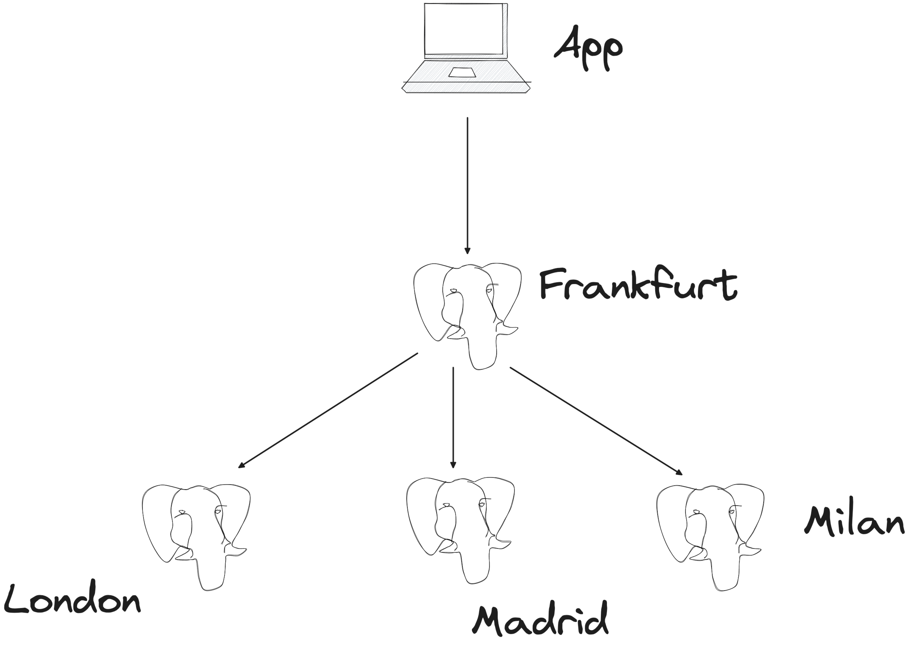

# PostgreSQL® data sharding with Foreign Data Wrappers

Sharding in PostgreSQL is available in a number of different ways, including using extensions like [citus](https://github.com/citusdata/citus). This example shows how to perform data sharding it using PostgreSQL [Foreign Data Wrappers](https://www.postgresql.org/docs/current/postgres-fdw.html) (FDW).



The overall architecture involves:
* A **primary** PostgreSQL instance, located in Frankfurt, where all the writes will be directed to
* Three **secondary** PostgreSQL instances, located in Madrid, London, and Milan that will host subsets of the data.


## PostgreSQL setup 

You can create you PostgreSQL databases in various methods, we'll use [Aiven](https://go.aiven.io/francesco-signup) and the [CLI](https://docs.aiven.io/docs/tools/cli) to create four instances of PostgreSQL located in Frankfurt, Madrid, London and Milan. 

```bash
avn service create pg-frankfurt \
    -t pg   \
    -p startup-4 \
    --cloud aws-eu-central-1

avn service create pg-madrid \
    -t pg   \
    -p startup-4 \
    --cloud aws-eu-central-1

avn service create pg-london \
    -t pg   \
    -p startup-4 \
    --cloud aws-eu-west-2

avn service create pg-milan \
    -t pg   \
    -p startup-4 \
    --cloud aws-eu-south-2
```
## Create the tables on each database

The second step is to create a table called `TEST` in each database, again we can use the [Aiven CLI](https://docs.aiven.io/docs/tools/cli) to connect (requires `psql` installed).


To connect to `pg-madrid` we can execute:

```bash
avn service cli pg-madrid
```

And then create the `test` table with:

```sql
CREATE TABLE TEST (id serial, description text, country text);
```
We can do the same for `pg-milan` in another terminal with:

```bash
avn service cli pg-milan
```
and, to create the table

```sql
CREATE TABLE TEST (id serial, description text, country text);
```

Same for `pg-london`:

```bash
avn service cli pg-london
```

and

```sql
CREATE TABLE TEST (id serial, description text, country text);
```

Finally, for our main database `pg-frankfurt`, we can connect with:

```bash
avn service cli pg-frankfurt
```

And then create the table with the following two commands:

```sql
CREATE TABLE TEST (id serial, description text, country text) PARTITION BY LIST(country);
CREATE TABLE TEST_FR PARTITION OF TEST FOR VALUES IN ('FR');
```

Please note that in Frankfurt, unlike the other databases, we are creating a partitioned table (`PARTITION BY LIST(country)`) and a local partition `TEST_FR` containing the data with country = `FR`

## Periodically query the data in the various test tables

In each connection we can check the updated status of the  `test` table by writing the query

```sql
select * from test;
```

and then using the `watch` command to run it every 2 seconds

```sql
\watch 2
```

## Create the Foreign data wrapper servers and user mapping

While on the `pg-frankfurt` connection, we need to create pointers to the secondary servers and map local users to remote users.

First of all we need to create the extension

```sql
CREATE EXTENSION postgres_fdw;
```

Then create the server with the host, port and database name (the following is pointing to the `pg-milan` database)

```sql
CREATE SERVER pg_milan
        FOREIGN DATA WRAPPER postgres_fdw
        OPTIONS (host 'pg-milan-project-name.aivencloud.com', port '18025', dbname 'defaultdb');
```

Note: You will need to change the name of the `host`, `port` and `dbname` depending on where your database is located. If you're using Aiven you can retrieve the details with:

```bash
avn service get pg-milan --format '{service_uri_params}'
```

Which will provide a json output like the following:

```json
{
    "dbname": "defaultdb", 
    "host": "pg-milan-project-name.aivencloud.com", 
    "password": "PSW123", 
    "port": "18025", 
    "sslmode": "require", 
    "user": "avnadmin"
}
```

Next we need to create a user mapping for the `avnadmin` local user to the remote user (still `avnadmin` tho) passing the right password. You can fetch the password from the result of the previous `avn service` command.

```sql
CREATE USER MAPPING FOR avnadmin
        SERVER pg_milan
        OPTIONS (user 'avnadmin', password 'PSW123');
```

Now we can create a foreign table, included as a partition of the original `TEST` table, and pointing to the `test` table in the `pg_milan` server with:

```sql
CREATE FOREIGN TABLE pg_milan_tbl PARTITION OF TEST FOR VALUES IN ('MI')
    SERVER pg_milan
    OPTIONS (schema_name 'public', table_name 'test');
```

Note: the foreign table `pg_milan_tbl` is declared as partition of the `TEST` table containing all the data having country = `MI`

We need to do the same for the other databases in London and Madrid, you can find below the full script (remember to change `host`, `port`, `dbname` and `password`).

```
CREATE SERVER pg_madrid
        FOREIGN DATA WRAPPER postgres_fdw
        OPTIONS (host 'pg-madrid-project-name.aivencloud.com', port '18025', dbname 'defaultdb');

CREATE USER MAPPING FOR avnadmin
        SERVER pg_madrid
        OPTIONS (user 'avnadmin', password 'PSW123');

CREATE FOREIGN TABLE pg_madrid_tbl PARTITION OF TEST FOR VALUES IN ('MA')
    SERVER pg_madrid
    OPTIONS (schema_name 'public', table_name 'test');

CREATE SERVER pg_london
        FOREIGN DATA WRAPPER postgres_fdw
        OPTIONS (host 'pg-london-project-name.aivencloud.com', port '18025', dbname 'defaultdb');

CREATE USER MAPPING FOR avnadmin
        SERVER pg_london
        OPTIONS (user 'avnadmin', password 'PSW123');

CREATE FOREIGN TABLE pg_london_tbl PARTITION OF TEST FOR VALUES IN ('LO')
    SERVER pg_london
    OPTIONS (schema_name 'public', table_name 'test');
```

Now we have everything in place to do sharding: every time we insert into the main `TEST` table we'll have:
* Data stored locally in the main Frankfurt database if `country='FR'`
* Data stored remotely in the secondary Milan database if `country='MI'`
* Data stored remotely in the secondary London database if `country='LO'`
* Data stored remotely in the secondary Madrid database if `country='MA'`

The above architecture is shown in the below image:


## Insert into the table

To test the architecture, we can try inserting in the `TEST` table and we should see the relevant rows appearing in the local databases.

```sql
INSERT INTO TEST (description, country) values ('test 1 should land in Frankfurt', 'FR');
```

```sql
INSERT INTO TEST (description, country) values ('test 2 should land in Madrid', 'MA');
```

```sql
INSERT INTO TEST (description, country) values ('test 3 should land in Milan', 'MI');
```

```sql
INSERT INTO TEST (description, country) values ('test 4 should land in London', 'LO');
```

The result should be similar to this video:


License
============
PostgreSQL® sharding with Foreign Data Wrappers is licensed under the Apache license, version 2.0. Full license text is available in the [LICENSE](LICENSE) file.

Please note that the project explicitly does not require a CLA (Contributor License Agreement) from its contributors.

Contact
============
Bug reports and patches are very welcome, please post them as GitHub issues and pull requests at https://github.com/aiven/postgresql-sharding-with-fdw . 
To report any possible vulnerabilities or other serious issues please see our [security](SECURITY.md) policy.
